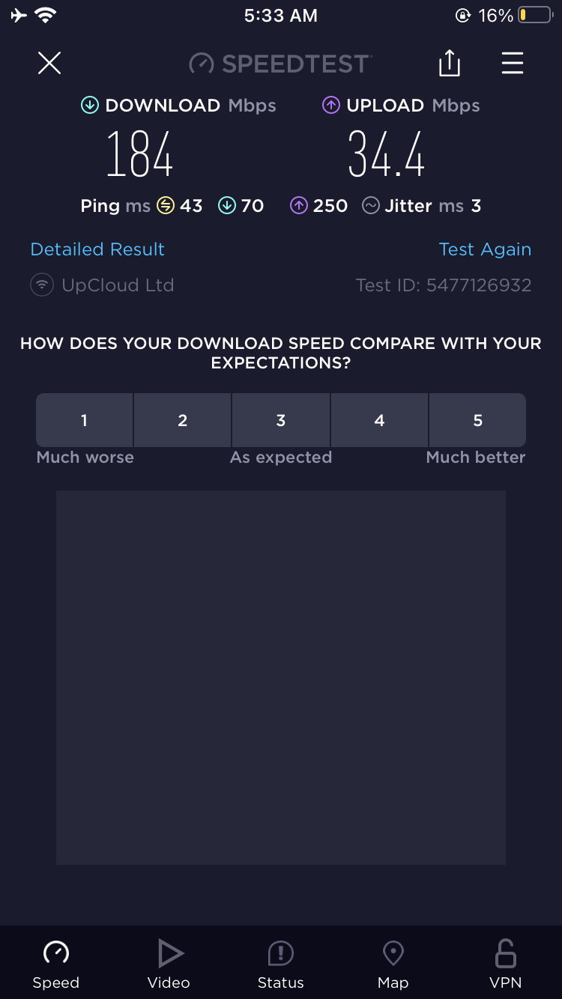
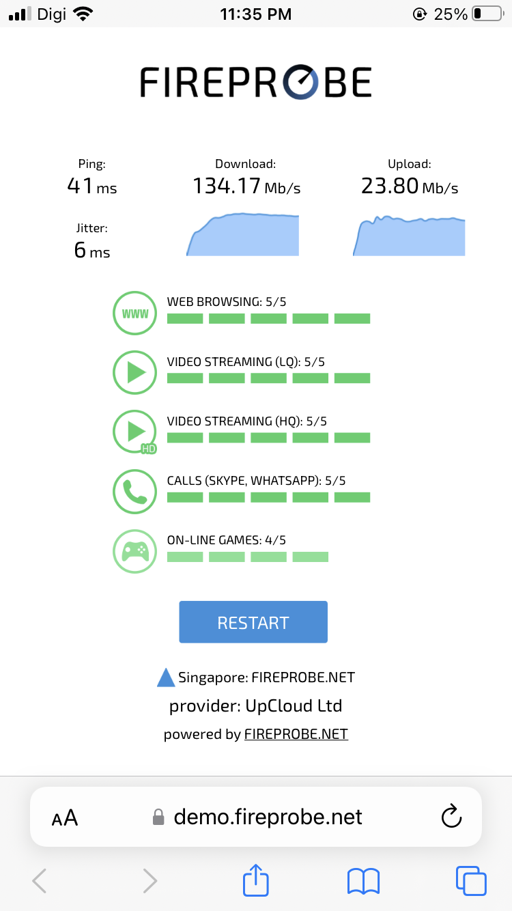
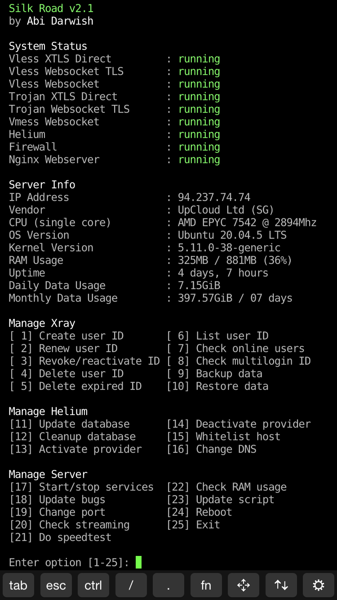
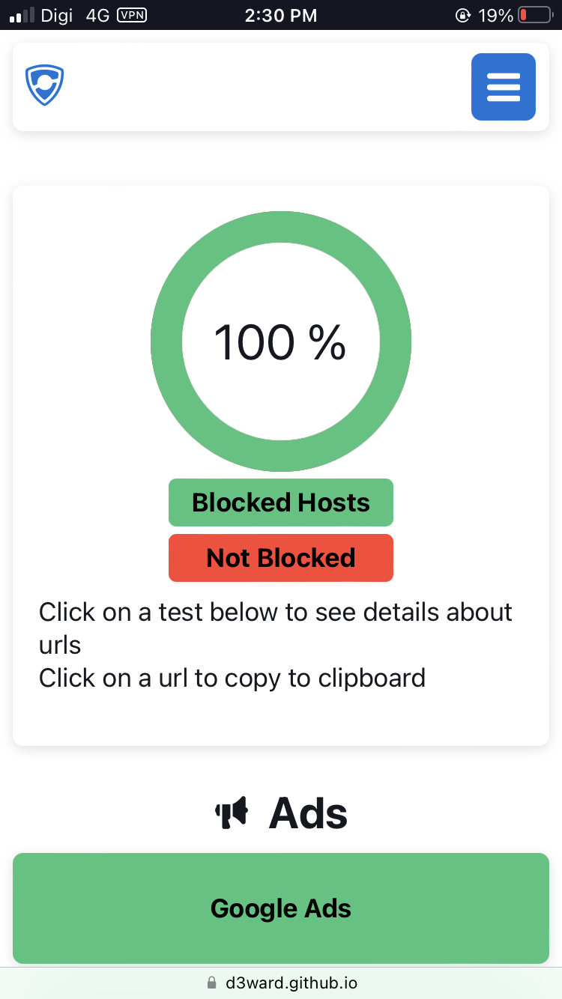
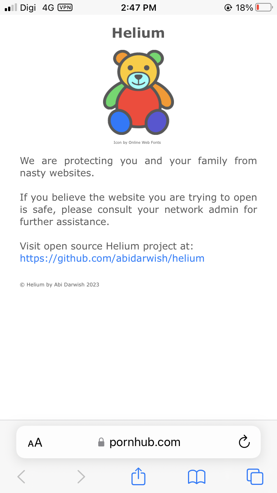

# Silk Road

Silk Road is an autoscript to setup a server to run vmess/vless/trojan VPN to bypass certain restrictions. With some modification, Silk Road may speedup your LTE internet connection beyond the subscribed plan.

  

 

  

Silk Road will help you manage your users (clients) through terminal. Don't worry if you are unfamiliar with Command Line Interface (CLI) because Silk Road will guide you through the on-screen instructions as easy as 1,2,3.

  

Not only that, Silk Road enables you to check multilogin users so that you can block their IDs. It also enables you to block unwanted url such as porn/torrent/ads/malware/phishing and many more by integrating [Helium app](https://github.com/abidarwish/helium).

 

  

Requirement: Ubuntu VPS.

For premium technical support, please contact: [Abi Darwish](https://t.me/abidarwish)
