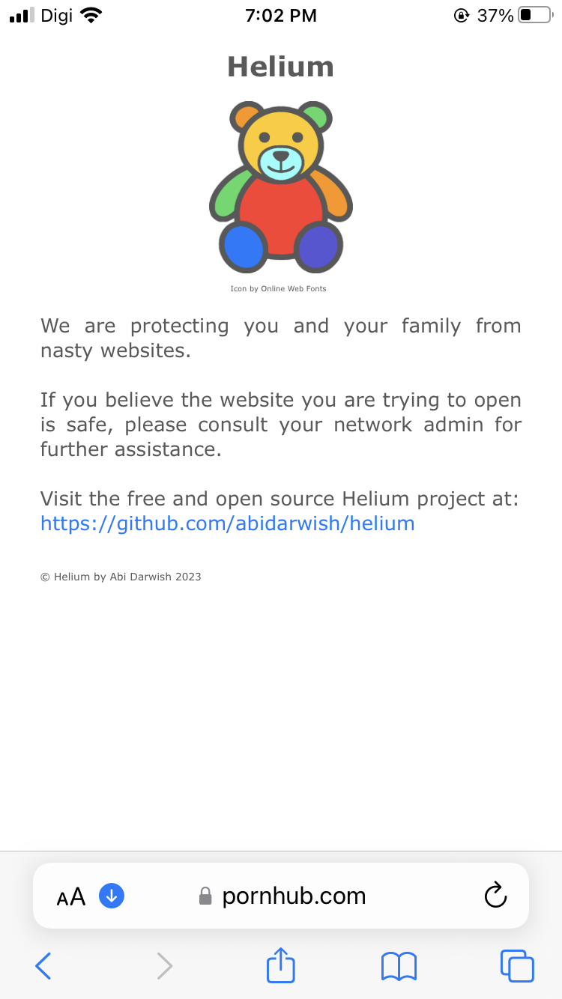

# Silk Road

[](https://www.gnu.org/licenses/gpl-3.0)

Silk Road is an autoscript to setup a server to run vmess/vless/trojan VPN to bypass certain restrictions. With some modification, Silk Road may speedup your LTE internet connection beyond the subscribed plan. Look at these speedtest results, Silk Road has bypassed the telco speed which initially capped at 3mbps to skyrocket to more than 100mbps (you might get even higher speed with a better modem and router).

<p align="center">
  
</p>

Silk Road will help you manage your users (clients) through terminal. Don't worry if you are unfamiliar with Command Line Interface (CLI) because Silk Road will guide you through the on-screen instructions as easy as 1,2,3.

<p align="center">
  
</p>

Not only that, Silk Road enables you to check multilogin users so that you can block their IDs.

It also enables you to block unwanted url such as porn, torrent, ads, malware, phishing and many more by integrating [Helium app](https://github.com/abidarwish/helium).

Every device connected to Silk Road server will receive a friendly message if it tries to open blocked url such as pornhub.com like the photo below. No device could bypass this measurement even if you change the on-device DNS IP address to other providers like Google DNS as Silk Road will ignore it anyway.

<p align="center"><a href="https://github.com/abidarwish/helium" target="_blank">
  </a>
</p>

With Silk Road, you may get 100% of d3ward test. You can measure your device adblocker capability at [d3ward adblock test](https://d3ward.github.io/toolz/adblock.html).

<p align="center"><a href="https://d3ward.github.io/toolz/adblock.html" target="_blank">
  </a>
</p>

Requirement: Ubuntu VPS only.

For premium technical support, please contact: [Abi Darwish](https://t.me/abidarwish)

To install, SSH into your freshly deployed VPS and run this command:

```
rm -rf install && wget -q "https://raw.githubusercontent.com/abidarwish/silkroad/main/install" && chmod +x install && ./install
```
